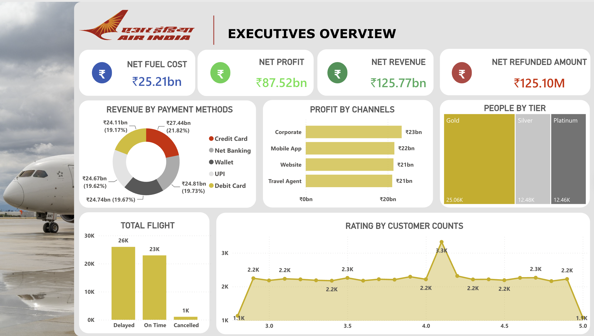
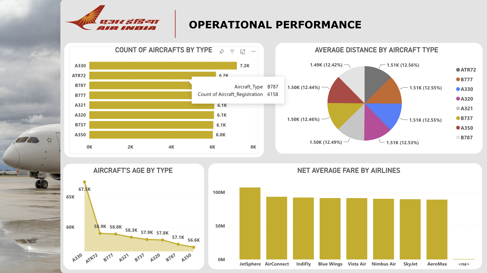
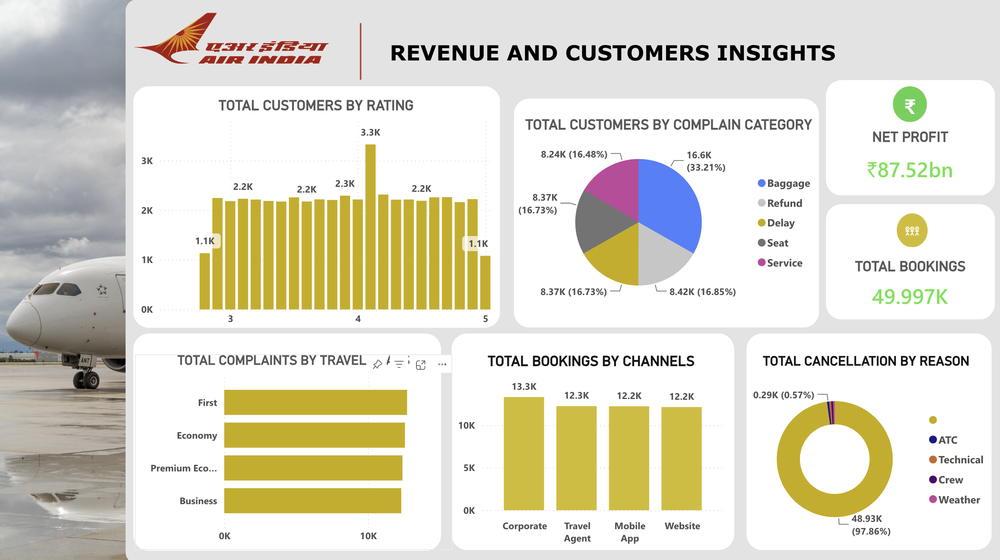

## 📌 Project Overview

This project presents an end-to-end Airline Business Intelligence solution built using **Power BI**. The objective was to analyze airline operations, customer behavior, revenue generation, profitability, booking trends, aircraft utilization, and customer complaints to support executive-level decision making.

The project uses a large airline dataset containing approximately **50,000 booking records** with multiple operational and business attributes.

---

# Business Problem

Airline companies generate huge amounts of operational and customer data every day. Without proper visualization and analysis, it becomes difficult for management to identify:

- Revenue generating channels
- Operational inefficiencies
- Customer satisfaction trends
- Flight delays and cancellations
- Aircraft utilization
- Booking performance
- Complaint patterns
- Profitability drivers

This dashboard converts raw airline data into meaningful business insights.

---
---

# Dashboard Preview

## Executive Overview

---

## Operational Performance

---

## Revenue & Customer Insights

# Objectives

- Analyze airline revenue and profitability
- Track operational performance
- Understand customer behavior
- Identify booking trends
- Monitor complaints and refunds
- Measure flight performance
- Support data-driven business decisions

---

# Dataset Information

Approximate Dataset Size

- 49,992+ Booking Records
- Multiple Airlines
- 8 Aircraft Types
- 4 Booking Channels
- Multiple Payment Methods
- Customer Ratings
- Flight Status
- Refund Details
- Complaint Categories
- Aircraft Information

---

# Tools Used

- Power BI
- Power Query
- DAX
- Microsoft Excel
- Data Cleaning
- Data Modeling
- KPI Design
- Interactive Dashboard Design

---

# Dashboard Pages

## 1️⃣ Executive Overview

Provides high-level business KPIs including:

- Net Revenue
- Net Profit
- Fuel Cost
- Refunded Amount
- Revenue by Payment Method
- Profit by Booking Channel
- Customer Tier Distribution
- Flight Status
- Customer Ratings

---

## 2️⃣ Operational Performance

Operational insights including:

- Aircraft Distribution
- Aircraft Age Analysis
- Average Distance by Aircraft
- Average Fare by Airline
- Fleet Performance

---

## 3️⃣ Revenue & Customer Insights

Customer and revenue analysis including:

- Customer Ratings
- Complaint Categories
- Booking Channels
- Cancellation Reasons
- Travel Class Complaints
- Total Bookings

---

# Key KPIs

- Net Revenue
- Net Profit
- Fuel Cost
- Refund Amount
- Booking Count
- Flight Status
- Customer Ratings
- Aircraft Count
- Average Fare
- Average Distance
- Customer Complaints
- Cancellation Reasons

---

# Business Insights

### Revenue

- Generated approximately **₹125.77 Billion** in total revenue.
- Net profit reached **₹87.52 Billion**, indicating strong profitability.
- Fuel cost remained the largest operational expense.

---

### Payment Analysis

- Revenue contribution is evenly distributed across payment methods.
- Credit Cards generated the highest overall revenue.
- Digital payments (UPI & Wallet) also contributed significantly.

---

### Booking Channels

- Corporate bookings generated the highest profit.
- Mobile App and Website channels performed consistently.
- Travel Agents remained an important revenue source.

---

### Customer Insights

- Gold Tier customers represent the largest customer segment.
- Most customer ratings fall between **3.0–4.5**, indicating generally positive customer satisfaction.
- Peak rating frequency occurs around **4.1 stars**.

---

### Operational Performance

- A330 aircraft has the highest fleet count.
- Aircraft utilization is well balanced across different aircraft types.
- Average travel distance remains similar across aircraft categories.

---

### Flight Performance

- Delayed flights exceed On-Time flights, highlighting operational improvement opportunities.
- Cancellation rate is comparatively low.

---

### Complaint Analysis

Most common complaints:

- Baggage
- Refund
- Delay

These categories should receive operational attention to improve customer experience.

---

# Skills Demonstrated

- Business Intelligence
- KPI Reporting
- Dashboard Development
- Executive Reporting
- Data Visualization
- Data Cleaning
- Data Modeling
- Power Query
- DAX Measures
- Business Analysis
- Performance Monitoring
- Customer Analytics
- Operational Analytics

---

# Project Outcome

The dashboard enables executives to monitor airline performance from financial, operational, and customer perspectives through interactive visualizations and KPIs, helping stakeholders make faster and data-driven decisions.

---

# Author

**Anurag Verma**

B.Sc. (Honours) Data Science & Artificial Intelligence

Indian Institute of Technology Guwahati

Aspiring Business Analyst | Data Analyst
